# Hi, I'm Dev Scipio 👋

Fullstack developer · Nairobi, Kenya 

I build fast, reliable web products, with a focus on healthtech. I run a medical laboratory department, so I understand LIS, analyzers and clinical workflows from the inside. By night I turn that knowledge into software that fits how labs actually work.

## What I'm Working On

- 🧪 **Reagent tracker**: inventory and usage tracking for lab environments
- 🧾 **Invoicing and storefront platform** for a medical services provider
- 🌍 **Client and volunteer builds** for Kenyan businesses and organisations
  

## Currently
- 🔭 Building: lab LIS MVP
- 📚 Learning: TypeScript, system design ,🐳 **DevOps fundamentals**: Linux, Docker, nginx and CI/CD
- 🤝 Open to: healthtech and lab software collaborations
- 💬 Ask me about: LIS, analyzers, clinical workflows, Prisma, Node ,Express , Postgres, React , web animations & creative web development
## Tech Stack

**Frontend:** TanStack Query, Zustand, React Hook Form, Zod, shadcn/ui
**Backend:** JWT auth with httpOnly cookies, layered architecture (model → service → controller → router)

## Why Healthtech?
Am a licensed medical lab scientist.

## Let's Connect

- 🌐 Portfolio: https://scipioportfolio-two.vercel.app/
- 💼 Freelance: **Zama Systems**
- 📧 Email: eaphoney@gmail.com
- 🔗 LinkedIn: []

## GitHub Stats

  
  

  

  

---

*Open to full-time developer opportunities and select freelance projects.*
